# Predicting Cardiovascular Disease
___
By: Cassie Nutter

# Description
---
This project looks at predicting whether a person has cardiovascular disease or not using classification. I utilized and compared multiple different models to find the best find the one that is able to achieve the best results while minimizing false negatives.

# Background about Cardiovascular Disease
---
Cardiovascular disease, also called heart disease, is a class of diseases that involve the heart or blood vessels. Cardiovascular disease (CVD) includes:

* Atherosclerosis (plaque build up in walls of arteries)
* Myocardial infarction (heart attack)
* Stroke
* Heart failure
* Arrhythmia (abnormal heart rhythm)
* Heart valve problems (valves not opening or closing enough)

[Source: American Heart Association](https://www.heart.org/en/health-topics/consumer-healthcare/what-is-cardiovascular-disease)

# Data Used
---
The data used for this project was obtained from [Kaggle](https://www.kaggle.com/sulianova/cardiovascular-disease-dataset), but can also be accessed in the data folder.

The data contains 12 features and 1 target feature. Six features are continuous and six are categorical. It is a larger dataset with 70,000 entries. The target variable is balanced - almost exactly 50/50.

Feature descriptions are as follows:
1. ID number
2. Age |(days)
3. Height |(cm) 
4. Weight |(kg)
5. Gender 
6. Systolic blood pressure 
7. Diastolic blood pressure
8. Cholesterol
9. Glucose
10. Smoking
11. Alcohol intake
12. Physical activity
13. Presence or absence of cardiovascular disease | Target Variable 

# Data Cleaning
---
Data was scrubbed by:
* checking for null values and duplicates
* dropping ID's
* changing age from days to years
* removing suspicious data
    * heights and weights that seemed too high or too low
    * systolic or diastolic pressure readings that were negative, unusually low, or diastolic was lower than systolic
* changed columns names

Scrubbing data removed 1,488 data points from original 70,000.
Target variable was checked again to see that cleaning did not drastically alter class balance. Ratio for target feature was still 50/50.

# Data Exploration
---
Different features were examined to determine if any had an individual correlation to cardiovascular disease.

First, a feature was created to look at body mass index. Body mass index (BMI) is a measure of body fat based on height and weight that applies to adult men and women.

Using height and weight, I was able to create a BMI column and see that individuals diagnosed with cardiovascular disease do have higher BMI's than those that do not have cardiovascular disease. 
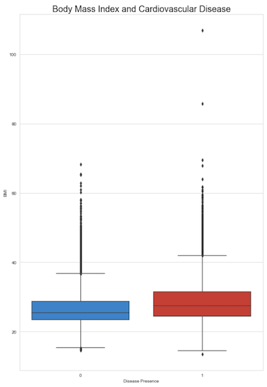

---
Next, I looked at blood pressure. Blood pressure is the pressure of circulating blood against the walls of blood vessels. Most of this pressure results from the heart pumping blood through the circulatory system. The American Heart Association categorizes blood pressures by the systolic and diastolic measurements that are taken. 
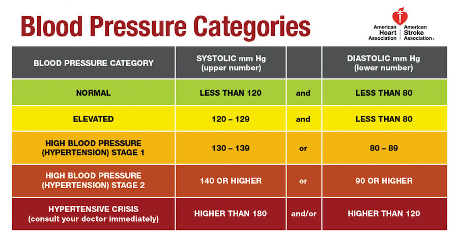

Using the systolic and diastolic data to create the same categories, it appeared that patients with blood pressures in the "High Blood Pressure (Hypertension) Stage 2" category were most as risk of being diagnosed with CVD. Individuals with extremely high blood pressure (categorized as "Hypertensive Crisis" were also severely at risk of having CVD.
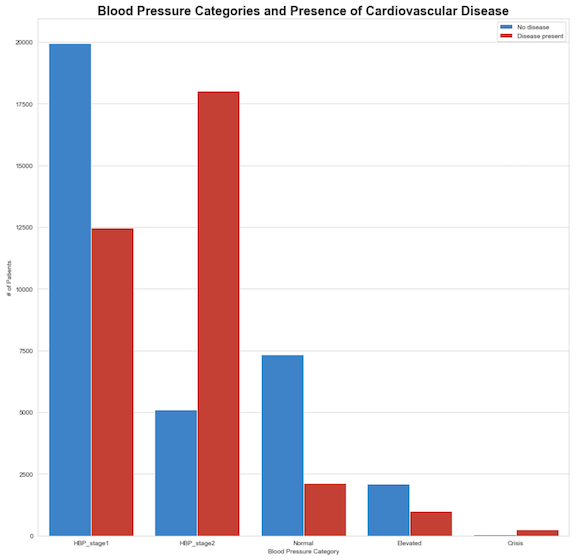

---
After that, I looked at age. I grouped ages into decades to see if there was a pattern. Younger individuals (in 30's and 40's) had a decreased risk of being diagnosed with cardiovascular disease. However, once in the 50's and 60's, one was more likely to be diagnosed with CVD and being in your 60's doubles the risk.

I also looked at ages and weight. The 30's had the smallest range of weights. The other ages were fairly similar, though it was clear that as one aged, being lighter in weight did not prevent them from being diagnosed with CVD.
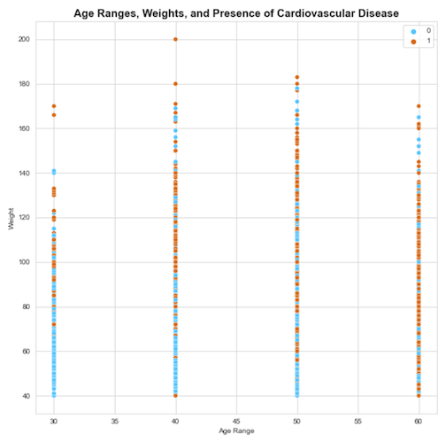

---
Not only did this study have a balanced amount of people with and without the disease, gender had fairly equal amounts of those with and without CVD. However, it is important to note that the proportion of men and women was not balanced, having almost two-thirds of the data being women, and a little over one-third of the data as men. This data shows that one gender is not more at risk than the other.

---
In this data cholesterol was ranked as 1: Normal, 2: Above normal, or 3: Well above normal A quick check found that individuals with above normal or well above normal levels of cholesterol were at an increased risk of having CVD. In face, 76% of those that had well above normal cholesterol as had cardiovascular disease.
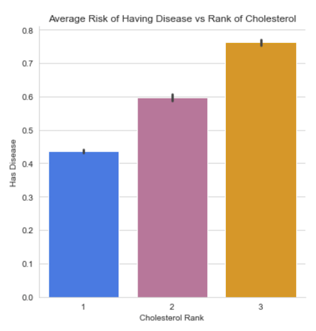

---
Other quick checks included: 
* Activity
    * Those with the disease have higher BMI's than those without the disease, regardless if they said they were active or not
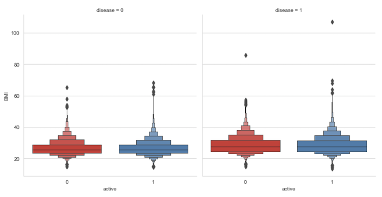
* Glucose
    * Those with glucose levels "Above normal" or "Well above normal" were diagnosed with CVD more often
* Drinking alcohol and smoking
    * Of those that said they drink and smoke, only 44% were diagnosed with CVD
    * Since this part of the data is subjective, it is not as conclusive

# Modeling
---
Again, the target feature here was whether an individual has cardiovascular disease or not.
The data was split into training and testing data and the training data was scaled using Standard Scaler.

The first models were built without any hyperparameter tuning. These models include:
* Logistic Regression
* Random Forest
* Support Vector Machines
* K-Nearest Neighbor
* Decision Tree
* XGBoost

The models were run and their results saved into a DataFrame.

Then each model was tuned using hyperparameters to see if the accuracy, F1 score, and false negatives could be improved. That data would be again saved into a DataFrame to compare all models.
A function was used to calculate the results after each model and save those results to the DataFrame. The function also displayed the classification report and a confusion matrix for the model.

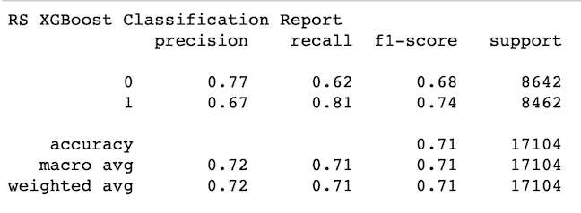
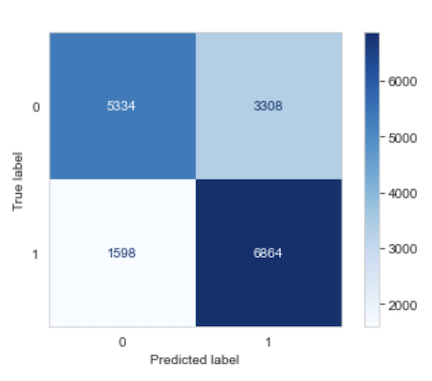

Randomized Search and Grid Search were both used to check parameters and try to establish the best ones.

# Interpretation
---
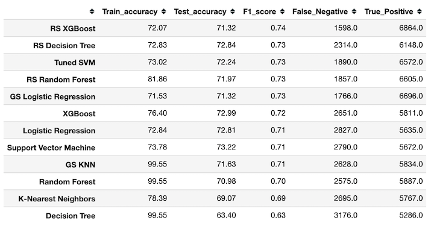

Results show that all of the tuned models performed better than their untuned counterparts when looking at F1 score, false negatives and true positives. Some of the tuned models accuracy decreased, but only slightly (approx. 2%) In addition, ROC curves were plotted for the tuned models. 
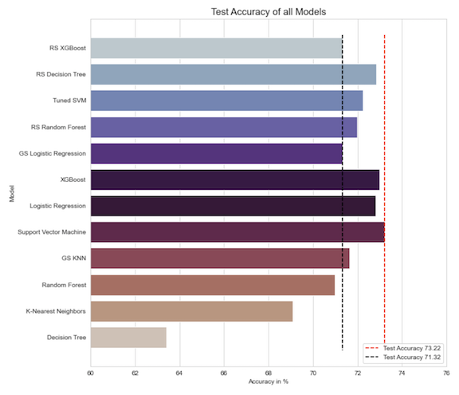
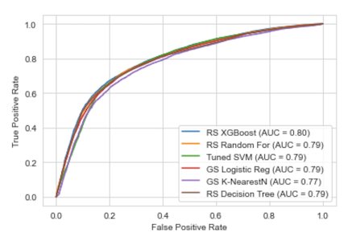

**Conclusion**

Judging by the highest F1 score, lowest number of false negative, highest number of true positives and greatest area under the curve (AUC) - the tuned XGBoost model performed the best. 
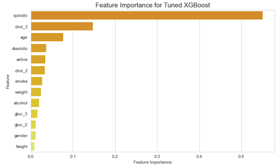

Looking at the winning model - Randomized Search XGBoost - I evaluated the important features. By far, the most important feature was the systolic reading in blood pressure. Having a cholesterol "well above normal" and age were the next largest important features. 

When looking at the subjective features, activity was the most important feature followed by smoking then drinking alcohol.

These features indicated that when faced with a patient who has a high systolic reading, very elevated cholesterol levels, and is older, it would be prudent to run further tests and check for cardiovascular diseases.

It would also be important to coach these patients about a need to increase activity, improve diet, and decrease or stop smoking and drinking alcohol. A follow up should be done to check blood pressure and cholesterol levels again and consider prescribing a statin drug that would decrease cholesterol levels.

# Future Work
---
In an ideal world, cholesterol and glucose would have been numerical results rather than categorical and the subjective features would have more context. Taking it one step further, cholesterol could have been separated in HDL and LDL and instead of glucose, measure A1C. 

Having knowledge about potential comorbidities - [like diabetes, COPD, and anxiety/depression](https://www.nap.edu/read/12940/chapter/18) would also be insightful and maybe help the model predictions.

Studies have proven there is [a link between cardiovascular disease and periodontal disease (gum disease)](https://www.health.harvard.edu/heart-health/gum-disease-and-heart-disease-the-common-thread#:~:text=Known%20as%20atherosclerosis%2C%20this%20fatty,not%20be%20a%20direct%20connection.). Adding data if the person has periodontal disease or not would be useful.

It would also be interesting if this set had data on the different regions, races, and socioeconomic levels from the individuals of this study as lack of access to care and implicit bias have shown to be dangerous to long-term health.
